# Dual System & Critique Prompt Improver

An advanced AI prompt optimization system that iteratively improves both **system prompts** and **critique prompts** simultaneously, creating a powerful dual optimization loop for maximum effectiveness.

## 🚀 Key Innovation

Unlike traditional prompt optimization that only improves the system prompt, this tool also evolves the **critique prompt** that evaluates the system prompt. This creates a meta-improvement loop where:

1. **System Prompt** gets better at fulfilling user tasks
2. **Critique Prompt** gets better at evaluating system prompts
3. **Both improve together** in a reinforcing cycle

## ✨ Features

- **Dual Optimization**: Improves both system and critique prompts simultaneously
- **Meta-Evaluation**: Evaluates the critique prompt's own performance
- **Intelligent Scheduling**: Configurable frequency for critique prompt evaluation
- **Comprehensive Tracking**: Detailed history of all improvements
- **Smart Early Stopping**: Prevents unnecessary iterations
- **Rich Configuration**: Highly customizable parameters
- **Beautiful Logging**: Clear, emoji-enhanced progress tracking
- **Multiple Output Formats**: JSON results, markdown summaries, individual prompt files

## 📁 Project Structure

```
├── dual_prompt_improver.py     # Main enhanced script with dual optimization
├── syspromptimprover.py       # Original single-prompt optimizer  
├── config.py                  # Configuration file
├── user_input.txt             # Your task description
├── initial_system_prompt.txt  # Starting system prompt
├── critique_system_prompt.txt # Starting critique prompt
└── README.md                  # This file
```

## 🛠️ Setup

1. **Clone the Repository**:
   ```bash
   git clone https://github.com/yourusername/dual-prompt-improver.git
   cd dual-prompt-improver
   ```

2. **Install Dependencies**:
   ```bash
   pip install -r requirements.txt
   ```

3. **Set API Key** (choose one):
   
   **For OpenAI models:**
   ```bash
   export OPENAI_API_KEY='your-openai-api-key-here'
   ```
   
   **For Anthropic models (Claude):**
   ```bash
   export ANTHROPIC_API_KEY='your-anthropic-api-key-here'
   ```

4. **Prepare Input Files**:
   - `user_input.txt` - Describe the task you want the system prompt to excel at
   - `initial_system_prompt.txt` - Your starting system prompt
   - `critique_system_prompt.txt` - Your starting critique prompt (or use the included one)

## 🚀 Usage

### Quick Start
```bash
python dual_prompt_improver.py
```

### Configuration
Edit `config.py` to customize:

```python
# Model selection (supports OpenAI and Anthropic)
MODEL_GENERATION = "claude-sonnet-4-20250514"       # For generating responses
MODEL_CRITIQUE = "claude-sonnet-4-20250514"         # For critiquing prompts
MODEL_REFINEMENT = "claude-sonnet-4-20250514"       # For refining prompts
MODEL_CRITIQUE_REFINEMENT = "claude-sonnet-4-20250514"  # For refining critique prompts

# Alternative OpenAI models:
# MODEL_GENERATION = "gpt-4.1-2025-04-14"
# MODEL_CRITIQUE = "gpt-4.1-2025-04-14"

# Optimization parameters
TARGET_SCORE = 95                    # Target score (1-100)
MAX_ITERATIONS = 15                  # Maximum iterations
IMPROVE_CRITIQUE_EVERY = 3           # Evaluate critique prompt every N iterations
CRITIQUE_IMPROVEMENT_THRESHOLD = 85  # When to improve critique prompt
```

## 📊 How It Works

### The Dual Optimization Loop

```mermaid
graph LR
    A[System Prompt] --> B[Generate Response]
    B --> C[Critique Prompt Evaluates]
    C --> D{Score ≥ Target?}
    D -->|No| E[Improve System Prompt]
    E --> A
    
    C --> F{Every N iterations}
    F --> G[Meta-Evaluate Critique Prompt]
    G --> H{Meta-Score < Threshold?}
    H -->|Yes| I[Improve Critique Prompt]
    I --> C
    H -->|No| C
```



### Evaluation Dimensions

The critique prompt is evaluated on:
- **Issue Identification** (25 points): How well it spots real problems
- **Scoring Calibration** (20 points): Appropriateness of scores given
- **Actionability** (25 points): Concrete, implementable suggestions
- **Comprehensiveness** (15 points): Coverage of all important aspects
- **Consistency** (15 points): Internal logic and coherence

## 📈 Output Files

After running, you'll get:

- `improved_system_prompt_TIMESTAMP.txt` - Your optimized system prompt
- `improved_critique_prompt_TIMESTAMP.txt` - Your optimized critique prompt
- `dual_improvement_results_TIMESTAMP.json` - Complete results and history
- `summary_report_TIMESTAMP.md` - Executive summary

## 🔧 Advanced Configuration

### Meta-Evaluation Weights
Customize how the critique prompt is evaluated:

```python
META_EVALUATION_WEIGHTS = {
    "issue_identification": 25,    # Weight for problem detection
    "scoring_calibration": 20,     # Weight for score appropriateness
    "actionability": 25,           # Weight for actionable suggestions
    "comprehensiveness": 15,       # Weight for thorough coverage
    "consistency": 15              # Weight for logical consistency
}
```

### Smart Features
- **Early Stopping**: Stops if no improvement for N iterations
- **Intermediate Saves**: Optional saving after each iteration
- **Model Selection**: Use different models for different tasks
- **Detailed Logging**: Configurable verbosity levels

## 💡 Tips for Best Results

1. **Start with a decent system prompt** - The better your starting point, the faster convergence
2. **Use a comprehensive critique prompt** - The included one covers 10+ evaluation dimensions
3. **Set realistic targets** - Scores above 90 are excellent, 95+ is exceptional
4. **Monitor meta-scores** - Watch how your critique prompt improves over time
5. **Experiment with frequencies** - Try different `IMPROVE_CRITIQUE_EVERY` values

## 🆚 Comparison: Single vs Dual Optimization

| Aspect | Single Optimization | Dual Optimization |
|--------|-------------------|------------------|
| **System Prompt** | Improves ✅ | Improves ✅ |
| **Critique Quality** | Static ❌ | Improves ✅ |
| **Evaluation Accuracy** | Fixed ❌ | Increases ✅ |
| **Long-term Performance** | Plateaus ❌ | Continues improving ✅ |
| **Robustness** | Limited ❌ | High ✅ |

## 📝 Example Results

```
🏁 FINAL RESULTS
==================================================
Final System Prompt Score: 97/100
Best Score Achieved: 97/100
Total Iterations: 8
Target Score: 95
Target Achieved: ✅ Yes
Critique Improvements: 2
```

## 🛡️ Safety Features

- **Prompt Length Limits**: Prevents excessively long prompts
- **API Error Handling**: Robust error recovery
- **Validation**: Input validation and sanity checks
- **Backup**: All intermediate results are saved

## 🔄 Migration from Original

To upgrade from the original `syspromptimprover.py`:

1. Copy your existing input files (they're compatible)
2. Run `dual_prompt_improver.py` instead
3. Enjoy the enhanced dual optimization!

## 🤝 Contributing

Feel free to:
- Add new evaluation dimensions
- Implement new optimization strategies  
- Enhance the meta-evaluation system
- Add support for other AI providers

## 📜 License

MIT License - Feel free to use and modify!

---

**Ready to revolutionize your prompt engineering?** 🚀

The dual optimization approach doesn't just make your prompts better—it makes them *continuously* better by improving the very system that evaluates them. This creates a virtuous cycle of improvement that traditional single-optimization approaches simply cannot achieve. 